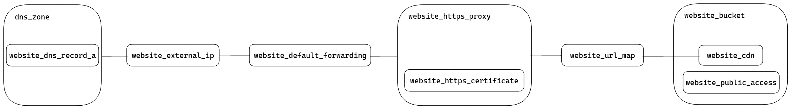

# Antoineamara.dev Deployment Module

This is a terraform module to deploy the static production assets to a GCP bucket and link it to a domain.
You can find a simple schema to give an overview of the elements used to deploy the static website.
Moreover, you have a description of the module with the requirements, the providers, the resources and, the inputs / outputs.

## Schema overview

This is a concise view of the elements created on GCP by the module and how they're connected:

* **static website**:

> **Note**: the schema represents the HTTPS process and how it is connected to the website. This module will configure an HTTP redirection to HTTPS but it is not represented in the schema.

* **backend functions**:

## Requirements

| Name | Version |
|------|---------|
|  [terraform](#requirement\_terraform) | >= 0.14 |
|  [archive](#requirement\_archive) | 2.2.0 |
|  [google](#requirement\_google) | 3.60.0 |
|  [null](#requirement\_null) | 2.1.2 |

## Providers

| Name | Version |
|------|---------|
|  [archive](#provider\_archive) | 2.2.0 |
|  [google](#provider\_google) | 3.60.0 |
|  [null](#provider\_null) | 2.1.2 |

## Modules

No modules.

## Resources

| Name | Type |
|------|------|
| [google_cloudfunctions_function.get_blog_posts_function](https://registry.terraform.io/providers/hashicorp/google/3.60.0/docs/resources/cloudfunctions_function) | resource |
| [google_cloudfunctions_function.get_github_profile_function](https://registry.terraform.io/providers/hashicorp/google/3.60.0/docs/resources/cloudfunctions_function) | resource |
| [google_cloudfunctions_function.submit_contact_form_function](https://registry.terraform.io/providers/hashicorp/google/3.60.0/docs/resources/cloudfunctions_function) | resource |
| [google_cloudfunctions_function_iam_member.get_blog_posts_invoker](https://registry.terraform.io/providers/hashicorp/google/3.60.0/docs/resources/cloudfunctions_function_iam_member) | resource |
| [google_cloudfunctions_function_iam_member.get_github_profile_invoker](https://registry.terraform.io/providers/hashicorp/google/3.60.0/docs/resources/cloudfunctions_function_iam_member) | resource |
| [google_cloudfunctions_function_iam_member.submit_contact_form_invoker](https://registry.terraform.io/providers/hashicorp/google/3.60.0/docs/resources/cloudfunctions_function_iam_member) | resource |
| [google_compute_backend_bucket.website_cdn](https://registry.terraform.io/providers/hashicorp/google/3.60.0/docs/resources/compute_backend_bucket) | resource |
| [google_compute_global_address.website_external_ip](https://registry.terraform.io/providers/hashicorp/google/3.60.0/docs/resources/compute_global_address) | resource |
| [google_compute_global_forwarding_rule.website_default_forwarding](https://registry.terraform.io/providers/hashicorp/google/3.60.0/docs/resources/compute_global_forwarding_rule) | resource |
| [google_compute_global_forwarding_rule.website_http_forwarding](https://registry.terraform.io/providers/hashicorp/google/3.60.0/docs/resources/compute_global_forwarding_rule) | resource |
| [google_compute_managed_ssl_certificate.website_https_certificate](https://registry.terraform.io/providers/hashicorp/google/3.60.0/docs/resources/compute_managed_ssl_certificate) | resource |
| [google_compute_target_http_proxy.website_http_proxy](https://registry.terraform.io/providers/hashicorp/google/3.60.0/docs/resources/compute_target_http_proxy) | resource |
| [google_compute_target_https_proxy.website_https_proxy](https://registry.terraform.io/providers/hashicorp/google/3.60.0/docs/resources/compute_target_https_proxy) | resource |
| [google_compute_url_map.http_to_https_url_map](https://registry.terraform.io/providers/hashicorp/google/3.60.0/docs/resources/compute_url_map) | resource |
| [google_compute_url_map.website_url_map](https://registry.terraform.io/providers/hashicorp/google/3.60.0/docs/resources/compute_url_map) | resource |
| [google_dns_managed_zone.dns_zone](https://registry.terraform.io/providers/hashicorp/google/3.60.0/docs/resources/dns_managed_zone) | resource |
| [google_dns_record_set.website_dns_record_a_root](https://registry.terraform.io/providers/hashicorp/google/3.60.0/docs/resources/dns_record_set) | resource |
| [google_dns_record_set.website_dns_record_a_www](https://registry.terraform.io/providers/hashicorp/google/3.60.0/docs/resources/dns_record_set) | resource |
| [google_storage_bucket.backend_functions_bucket](https://registry.terraform.io/providers/hashicorp/google/3.60.0/docs/resources/storage_bucket) | resource |
| [google_storage_bucket.website_bucket](https://registry.terraform.io/providers/hashicorp/google/3.60.0/docs/resources/storage_bucket) | resource |
| [google_storage_bucket_object.get_blog_posts_zip](https://registry.terraform.io/providers/hashicorp/google/3.60.0/docs/resources/storage_bucket_object) | resource |
| [google_storage_bucket_object.get_github_profile_zip](https://registry.terraform.io/providers/hashicorp/google/3.60.0/docs/resources/storage_bucket_object) | resource |
| [google_storage_bucket_object.submit_contact_form_zip](https://registry.terraform.io/providers/hashicorp/google/3.60.0/docs/resources/storage_bucket_object) | resource |
| [google_storage_default_object_access_control.website_public_access](https://registry.terraform.io/providers/hashicorp/google/3.60.0/docs/resources/storage_default_object_access_control) | resource |
| [null_resource.upload_website_to_bucket](https://registry.terraform.io/providers/hashicorp/null/2.1.2/docs/resources/resource) | resource |
| [archive_file.get_blog_posts_source](https://registry.terraform.io/providers/hashicorp/archive/2.2.0/docs/data-sources/file) | data source |
| [archive_file.get_github_profile_source](https://registry.terraform.io/providers/hashicorp/archive/2.2.0/docs/data-sources/file) | data source |
| [archive_file.submit_contact_form_source](https://registry.terraform.io/providers/hashicorp/archive/2.2.0/docs/data-sources/file) | data source |

## Inputs

| Name | Description | Type | Default | Required |
|------|-------------|------|---------|:--------:|
|  [authkey](#input\_authkey) | credential JSON filename for authentication | `string` | n/a | yes |
|  [authorized\_origins](#input\_authorized\_origins) | list of origins authorized to request the gcp backend functions | `string` | n/a | yes |
|  [dev\_api\_key](#input\_dev\_api\_key) | the authorization token for dev.to to retrieve the blog posts | `string` | n/a | yes |
|  [dist\_functions\_path](#input\_dist\_functions\_path) | the path of the folder containing gcp functions | `string` | `"/functions/"` | no |
|  [dist\_path](#input\_dist\_path) | the path of the dist folder containing the bundled files for the website | `string` | `"/dist/"` | no |
|  [domain](#input\_domain) | the domain name of the website | `string` | n/a | yes |
|  [gcp\_project\_id](#input\_gcp\_project\_id) | gcp project identifier for deployment | `string` | n/a | yes |
|  [github\_token](#input\_github\_token) | the authorization token for github.com to retrieve the user profile projects | `string` | n/a | yes |
|  [mail\_sender](#input\_mail\_sender) | SMTP mail sender | `string` | `"no-reply@antoineamara.dev"` | no |
|  [smtp\_host](#input\_smtp\_host) | SMTP server host address | `string` | n/a | yes |
|  [smtp\_password](#input\_smtp\_password) | SMTP user password for authentication | `string` | n/a | yes |
|  [smtp\_port](#input\_smtp\_port) | SMTP server destination port | `number` | `25` | no |
|  [smtp\_username](#input\_smtp\_username) | SMTP username for authentication | `string` | n/a | yes |

## Outputs

| Name | Description |
|------|-------------|
|  [get\_blog\_posts\_https\_url](#output\_get\_blog\_posts\_https\_url) | the https url to retrieve the blog posts from dev.to. |
|  [get\_github\_profile\_https\_url](#output\_get\_github\_profile\_https\_url) | the https url to retrieve the github profile projects. |
|  [submit\_contact\_form\_https\_url](#output\_submit\_contact\_form\_https\_url) | the https url to call to submit the contact form. |
|  [website\_configurations](#output\_website\_configurations) | website index and 404 error file configuration |
|  [website\_domain\_name](#output\_website\_domain\_name) | the website domain name (it is the bucket name too). |
|  [website\_ip](#output\_website\_ip) | the website external IP |
